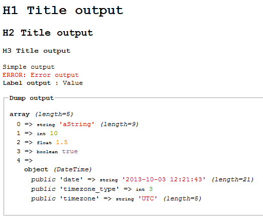

[](https://packagist.org/packages/crazy-max/cws-debug)
[](https://php.net/)
[](https://travis-ci.org/crazy-max/CwsDebug)
[](https://www.codacy.com/app/crazy-max/CwsDebug)
[](https://styleci.io/repos/13297266)
[](https://gemnasium.com/github.com/crazy-max/CwsDebug)
[](https://beerpay.io/crazy-max/CwsDebug)
[](https://www.paypal.com/cgi-bin/webscr?cmd=_s-xclick&hosted_button_id=CBCXP8HU9XFB4)

## About

PHP class to output additional messages for debug.

## Installation

```bash
composer require crazy-max/cws-debug
```

And download the code:

```bash
composer install # or update
```

## Getting started

See `tests/test.php` file sample to help you.

## Example



## Methods

**simple** - Output a message.<br />
**error** - Output error message.<br />
**dump** - Output a variable dump.<br />
**labelValue** - Output a value associated to a label.<br />
**titleH1** - Output title H1.<br />
**titleH2** - Output title H2.<br />
**titleH3** - Output title H3.<br />

**isQuietVerbose** - Check if verbose is quiet<br />
**setQuietVerbose** - Quiet verbose output : no output at all (default)<br />
**isSimpleVerbose** - Check if verbose is simple<br />
**setSimpleVerbose** - Simple verbose output : only output simple report<br />
**isReportVerbose** - Check if verbose is report<br />
**setReportVerbose** - Report verbose output : output a detail report<br />
**isDebugVerbose** - Check if verbose is debug<br />
**setDebugVerbose** - Debug verbose output : output detail report as well as debug info<br />
**setEchoMode** - Echo output mode (default)<br />
**setFileMode** - File output mode<br />

## How can i help ?

All kinds of contributions are welcomed :raised_hands:!<br />
The most basic way to show your support is to star :star2: the project, or to raise issues :speech_balloon:<br />
But we're not gonna lie to each other, I'd rather you buy me a beer or two :beers:!

[](https://beerpay.io/crazy-max/CwsDebug)
or [](https://www.paypal.com/cgi-bin/webscr?cmd=_s-xclick&hosted_button_id=CBCXP8HU9XFB4)

## License

MIT. See `LICENSE` for more details.
